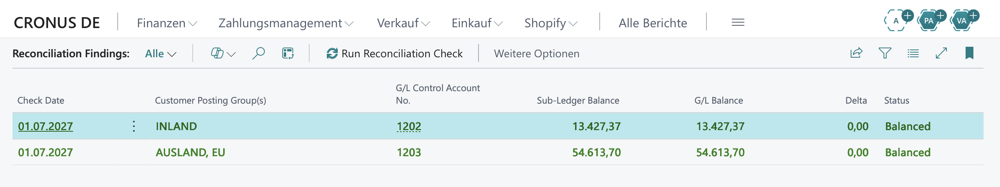
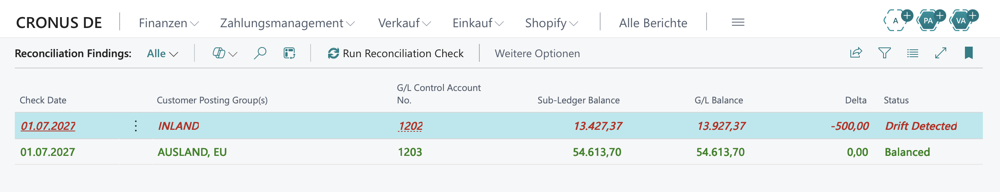

> [🇩🇪 Deutsch](README.md) | 🇬🇧 English

# Sub-Ledger Reconciliation for Business Central

A small, focused **Business Central (AL)** extension that catches **sub-ledger drift** — when the customer receivables sub-ledger stops agreeing with its G/L control account.

For each **G/L receivables control account** it compares the **open customer ledger entries** (summed remaining, LCY) against the **account balance**. Any non-zero difference is drift — a manual G/L posting, a reassigned posting group, a partial reversal. Pure aggregation, no judgment calls.

## Demo

A run against the BC **28.3** sandbox (DE localization, CRONUS). The extension changes **nothing** in the ledgers — it reads the data live and only surfaces drift.

**Starting point — balanced.** Sub-ledger and G/L agree, `Delta` = 0,00:

**After a wrong posting — drift detected.** A manual entry is posted straight to receivables control account `1202` (INLAND). That pushes the sub-ledger and G/L apart — the next run surfaces it, the row turns red, `Delta` = −500,00:

`AUSLAND` and `EU` both map to account `1203` and stay balanced — exactly the case the per-account reconciliation handles (see below).

## Why it matters

The sub-ledger and G/L are supposed to move together. Post **directly** to a receivables control account, or reassign a posting group, and they silently diverge — usually caught only at period close. This surfaces it on demand or on a schedule, any time.

## How drift happens

| Cause | Requires "Direct Posting"? |
|---|---|
| Posting group changed after the fact — old entries stay on the old control account, the customer now counts towards the new group | No |
| Data migration or API integration writes straight to the G/L, bypassing the standard posting routine | No |
| Partial reversal where only one side was unapplied | No |
| Manual G/L posting (the demo case, because it is the easiest to reproduce) | Yes |

The check doesn't test whether a rule was broken, but whether the numbers still agree — regardless of the cause.

## The design decision that matters

**Reconcile per control account, not per posting group.** Several posting groups can map to the *same* receivables account (e.g. `EU` and `AUSLAND` → `1203`). Comparing one group's partial sub-ledger to the account's full balance would report phantom drift. So the engine folds every group's open sub-ledger into its account and compares **once per account**, where the numbers are actually comparable.

## Objects

| Object | ID | Role |
|---|---|---|
| enum `Recon Status` | 50100 | Balanced / Drift Detected |
| table `Recon Finding` | 50101 | One finding per account per run (`Delta`/`Status` derived in `OnInsert`) |
| codeunit `Sub-Ledger Recon Mgt.` | 50102 | Core reconciliation logic |
| codeunit `Recon Check Job` | 50103 | Job Queue wrapper (schedulable) |
| page `Recon Findings` | 50104 | List UI + run action + red/green styling |

## Under the hood

- **Extension-only, upgrade-safe.** No base objects modified; it only *reads* base data (`Customer Posting Group`, `Cust. Ledger Entry`, `G/L Account`) through their public surface.
- **FlowFields, handled correctly.** `Remaining Amt. (LCY)` and G/L `Balance` are FlowFields, not stored columns — so they can't be `CalcSums`'d. The engine uses `SetAutoCalcFields` (server computes during the fetch — one set-based query, no N+1) and `CalcFields` for the single account balance.
- **Data never leaves the tenant.** Findings only — no external calls.
- **Schedulable.** Codeunit 50103 runs as a Job Queue Entry; the same core logic serves both the page button and the scheduler.

## Run it

Needs VS Code + the **AL Language** extension (17.0) and a BC **28.3** sandbox.

1. Open the folder in VS Code → **AL: Download symbols**.
2. `Ctrl+Shift+B` to compile, or **F5** to publish and launch.
3. Open **Reconciliation Findings** → **Run Reconciliation Check**.

**See drift live:** post a manual General Journal line straight to a receivables control account, then re-run — that row turns red with a non-zero delta.

To schedule: **Job Queue Entries → New**, Codeunit `50103`, set a recurrence, Status = Ready.

> `50100–50149` is a development ID range; an AppSource release needs a Microsoft-registered range.

## License

[MIT](LICENSE) © 2026 Matthias Mur
